# Module 02 – Footprinting and Reconnaissance  
### Full Lab Report – Information Gathering Using Metasploit  
(English Reconstruction of Original Report – Step-by-step, Detailed)

---

# Task 1 – Link Metasploit Framework to Database

## **Step 1 – Log into Kali Linux and open a Terminal window**  
**Objective:** Begin the lab by accessing the Kali Linux VM and verifying the environment.  
**Procedure:** Log into the VM, open a terminal, and confirm system details.  
**Result:** System information such as hostname, kernel version, OS type, and network interface details are displayed.  

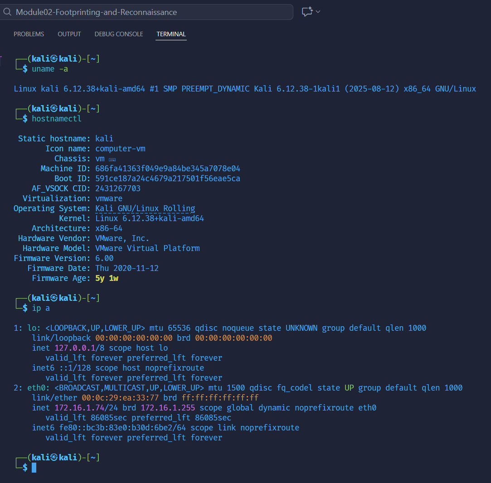

---

## **Step 2 – Start PostgreSQL service**  
**Objective:** Prepare the Metasploit database backend.  
**Procedure:**  
```
sudo service postgresql start
```  
**Result:** PostgreSQL service starts successfully, ready for Metasploit integration.  

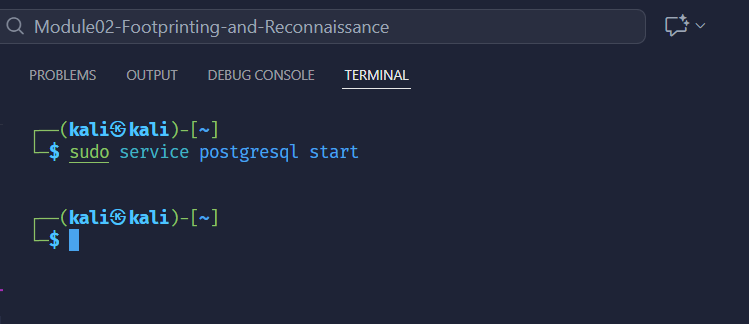

---

## **Step 3 – Launch Metasploit Framework**  
**Objective:** Open Metasploit Framework CLI.  
**Procedure:**  
```
msfconsole
```  
**Result:** Metasploit loads successfully with all modules initialized.  

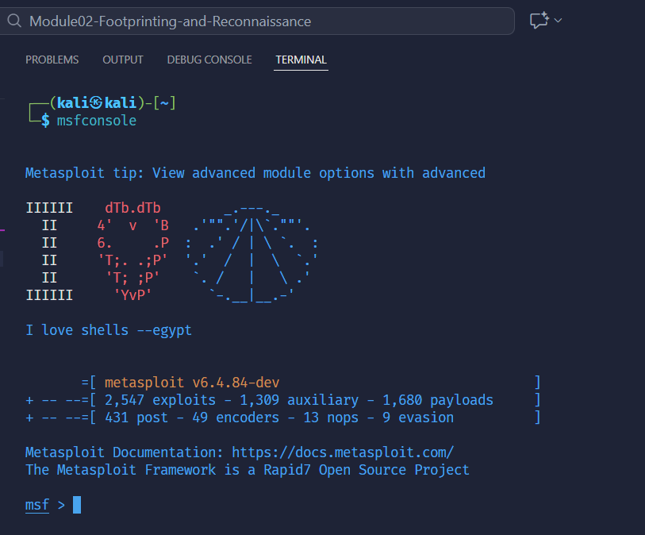

---

## **Step 4 – Check database connection status**  
**Objective:** Verify whether Metasploit is connected to PostgreSQL.  
**Procedure:**  
```
db_status
```  
**Result:** Output shows “not connected,” requiring initialization.  

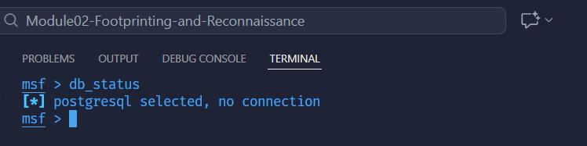

---

## **Step 5 – Exit msfconsole and initialize the database**  
**Objective:** Initialize Metasploit’s database structure and schema.  
**Procedure:**  
```
exit
msfdb init
```  
**Result:** Database user, database tables, and schema are created successfully.  

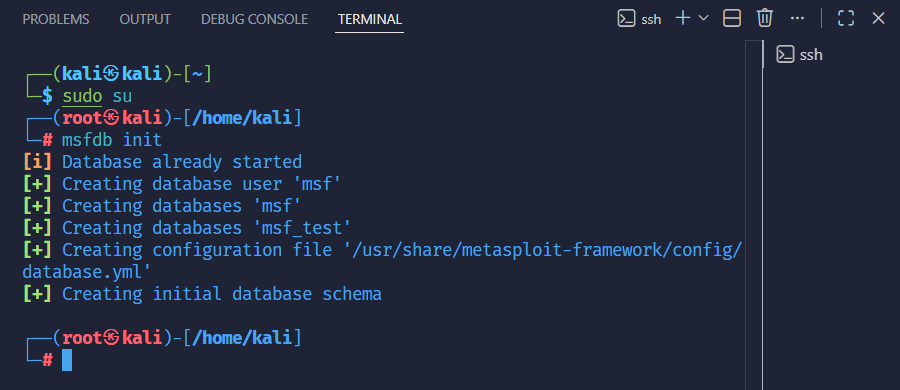

---

## **Step 6 – Restart PostgreSQL and relaunch Metasploit**  
**Objective:** Ensure a clean and active database connection.  
**Procedure:**  
```
service postgresql restart
msfconsole
```  
**Result:** PostgreSQL is restarted and Metasploit launches normally.  

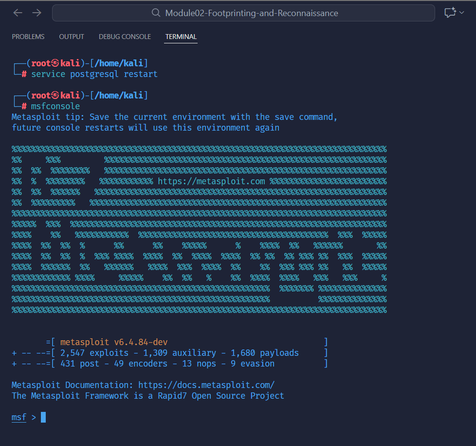

---

## **Step 7 – Verify database connection again**  
**Objective:** Confirm successful integration with PostgreSQL.  
**Procedure:**  
```
db_status
```  
**Result:** Metasploit reports “connected to msf,” meaning DB is ready.  

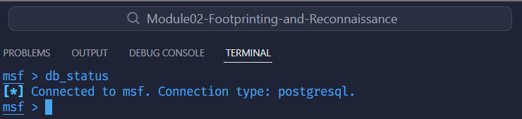

---

# Task 2 – Find Alive Hosts

## **Step 8 – Run an Nmap scan on the subnet**  
**Objective:** Discover active hosts and gather OS & service information.  
**Procedure:**  
```
nmap -Pn -sS -A -oX Test.xml 172.16.1.0/24
```  
**Result:** Nmap begins scanning all hosts in the subnet and exports results to XML.  

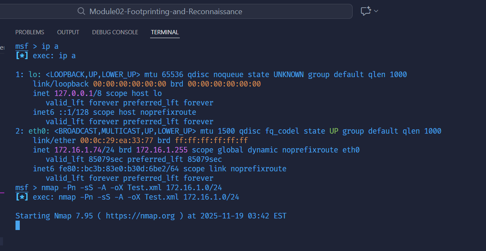

---

## **Step 9 – Nmap scanning results**  
**Objective:** Observe detected hosts and services.  
**Result:** Nmap identifies host 172.16.1.74 with SSH open and Linux OS detected.  

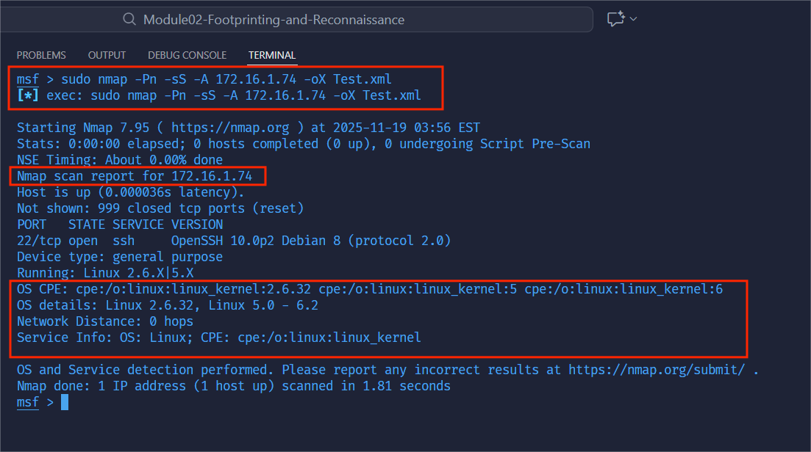

---

## **Step 10 – Import Nmap results into Metasploit**  
**Objective:** Store Nmap results inside Metasploit’s database.  
**Procedure:**  
```
db_import Test.xml
```  
**Result:** XML file is parsed, and host data is successfully imported.  


---

## **Step 11 – View discovered hosts**  
**Objective:** Confirm that imported hosts appear in database.  
**Procedure:**  
```
hosts
```  
**Result:** Host 172.16.1.74 appears with OS and purpose fields.  

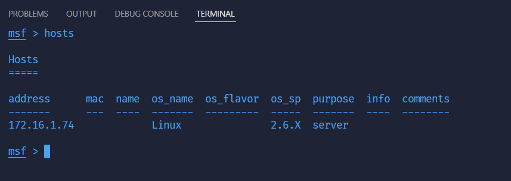

---

## **Step 12–14 – Scan target machine using db_nmap**  
**Objective:** Perform deeper OS and service enumeration.  
**Procedure:**  
```
db_nmap -sS -A 172.16.1.74
```  
**Result:** Metasploit identifies OS, SSH service, and Linux kernel range.  

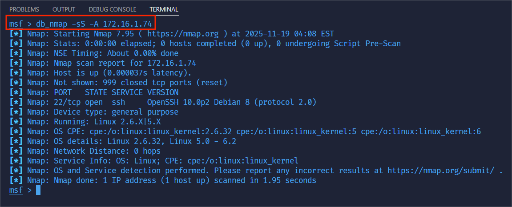

---

## **Step 15 – Display detected services**  
**Objective:** List services collected from previous scans.  
**Procedure:**  
```
services
```  
**Result:** One service identified—SSH on port 22.  

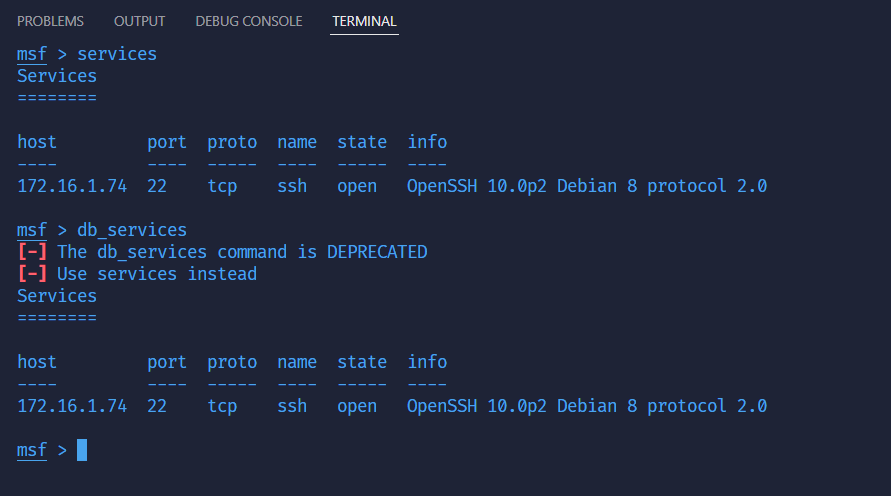

---

# Task 3 – Port & SMB Enumeration

## **Step 16 – Search for port scanning modules**  
**Objective:** Identify suitable modules for port scanning.  
**Procedure:**  
```
search portscan
```  
**Result:** Metasploit displays available port scanning modules.  

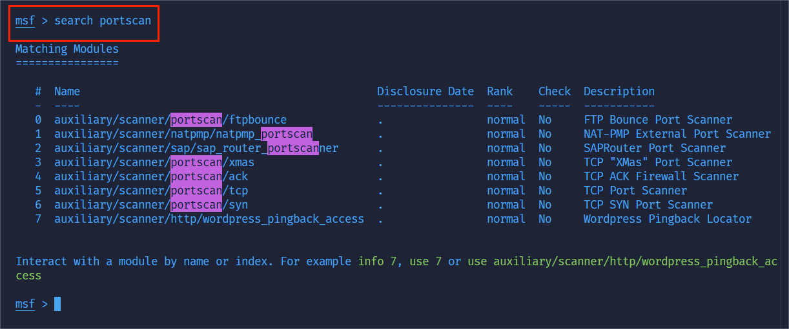

---

## **Step 17 – Load SYN port scanner module**  
**Objective:** Prepare Metasploit SYN scanner for port discovery.  
**Procedure:**  
```
use scanner/portscan/syn
```  
**Result:** SYN scan module loaded.  

---

## **Step 18 – Display SYN scan options**  
**Procedure:**  
```
show options
```  
**Result:** Module options such as RHOSTS and THREADS are shown.  


---

## **Step 19 – Configure target host**  
**Procedure:**  
```
set RHOSTS 172.16.1.163
```  
**Result:** Target IP for SYN scan is set.

---

## **Step 20 – Increase scan thread count**  
**Procedure:**  
```
set THREADS 200
```  
**Result:** Faster scanning capability enabled.

---

## **Step 21 – Run SYN scan module**  
**Procedure:**  
```
run
```  
**Result:** Open ports detected: 80, 135, 139, 443.  

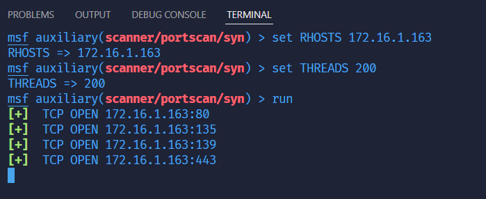


---

## **Step 22 – Load SMB version scanning module**  
**Procedure:**  
```
use scanner/smb/smb_version
```  
**Result:** SMB enumeration module loaded.  

---

## **Step 23 – Show SMB module options**  
**Procedure:**  
```
show options
```  
**Result:** Module parameters for SMB scanning displayed.  

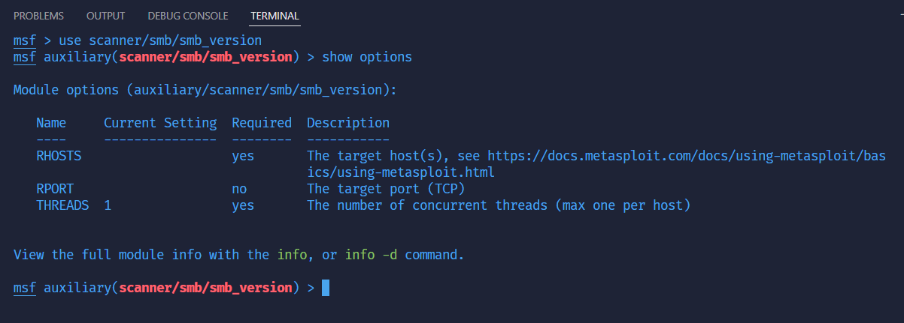

---

## **Step 24 – Configure RHOSTS range for SMB scan**  
**Procedure:**  
```
set RHOSTS 172.16.1.0/24
```  
**Result:** Module targets entire subnet.  

---

## **Step 25 – Increase SMB scan threads**  
**Procedure:**  
```
set THREADS 100
```  
**Result:** Improved scan performance.  

---

## **Step 26–27 – Run SMB enumeration**  
**Procedure:**  
```
run
```  
**Result:**  
SMB-enabled hosts discovered. OS versions recovered, including Windows 10 and Windows 11 systems.  

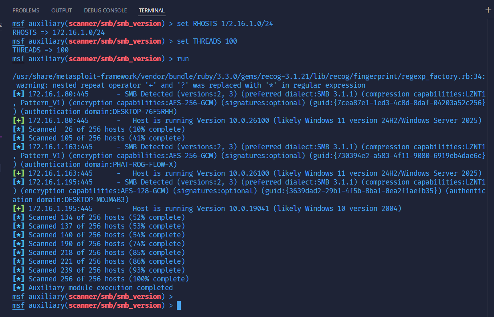

---

## **Step 28 – Display OS information for all hosts**  
**Procedure:**  
```
hosts
```  
**Result:** Host database updated with OS information from SMB and Nmap results.  

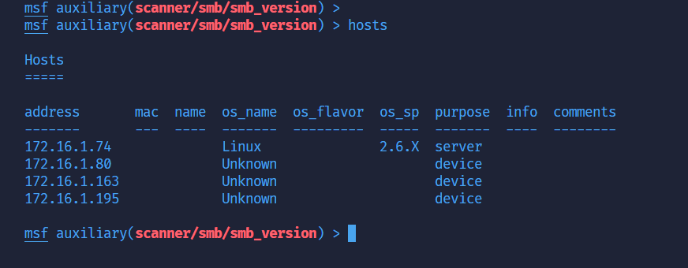


---

# **Lab Analysis**

This reconnaissance lab successfully used Metasploit to enumerate hosts, identify OS types, discover open ports, scan SMB capabilities, and store results in a structured database.  
The environment contains multiple Windows 11 devices using SMB 3.1.1, and one Linux machine running SSH.  
No SMBv1 hosts were detected, indicating strong security posture.

---

# **Conclusion**

This lab demonstrates the power of Metasploit in performing network reconnaissance, including:  
- PostgreSQL database integration  
- Nmap host discovery and import  
- Service enumeration  
- SYN port scanning  
- SMB version enumeration  
- OS fingerprinting  
- Comprehensive host database management  

All techniques shown are foundational for penetration testing and vulnerability assessment.

